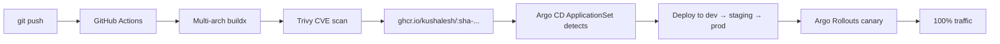

# 🛒 microservices-demo-app

[](./.github/workflows/build-and-push.yml)
[](./.github/workflows/manifests-validate.yml)
[](LICENSE)

> **Polyglot 3-microservice demo** designed to be deployed via the GKE platform — distroless images, full observability, progressive delivery, and end-to-end CI/CD to GHCR + GitOps.

---

## 🧩 Services

| Service | Language | Port | Purpose |
|---|---|---|---|
| `api-gateway`         | Go (chi)        | 8080 | Edge HTTP gateway, fans out to downstream services |
| `product-service`     | Node.js (Express) | 3000 | Catalog API |
| `notification-service`| Python (FastAPI)| 5000 | Posts notifications (email/sms/push) |

All three implement the same operational contract:
- `/healthz`, `/readyz` probes
- `/metrics` Prometheus endpoint with golden signals
- Structured JSON logs
- Graceful shutdown (SIGTERM)
- **Distroless** non-root images (`gcr.io/distroless/...`)

## 🏗 Layout

```
.
├── services/                 # Source code for each microservice
│   ├── api-gateway/          # Go
│   ├── product-service/      # Node.js
│   └── notification-service/ # Python
├── charts/microservices-app/ # Generic Helm chart (Deployment + Svc + HPA + PDB + ServiceMonitor + PrometheusRule)
├── deploy/                   # Per-service Kustomize overlays per env
│   ├── api-gateway/{base,overlays/{dev,staging,prod}}/
│   ├── product-service/...
│   └── notification-service/...
├── observability/            # Grafana dashboards
└── .github/workflows/        # build+scan+push to GHCR, kustomize/helm validate
```

## 🚀 CI/CD Flow



## 🔐 Container Security

- Multi-stage builds → minimal final image
- **Distroless base** — no shell, no package manager
- `USER nonroot` (UID 65532)
- Read-only root filesystem
- All Linux capabilities dropped
- Trivy scan on every build (CRITICAL/HIGH SARIF uploaded to GitHub Security tab)

## 📈 Observability

Every pod exposes `/metrics`. The Helm chart auto-generates:
- `ServiceMonitor` (scraped by `kube-prometheus-stack`)
- `PrometheusRule` with `HighErrorRate` and `HighLatencyP99` alerts
- `HPA` on CPU 70%
- `PodDisruptionBudget` minAvailable=1

Grafana dashboard JSON in [observability/](observability/).

## 🚦 Progressive Delivery

`api-gateway` in **prod** uses an `Argo Rollout` with weighted canary steps (10 → 25 → 50 → 100), with pauses for analysis. See [`deploy/api-gateway/overlays/prod/rollout.yaml`](deploy/api-gateway/overlays/prod/rollout.yaml).

## 🛠 Local Run

```bash
docker build -t api-gateway services/api-gateway
docker run --rm -p 8080:8080 api-gateway
curl localhost:8080/healthz
curl localhost:8080/metrics | head
```

## 📜 License

MIT — see [LICENSE](LICENSE).

---
**Author:** Kushalesh — Senior GKE Platform Engineer
